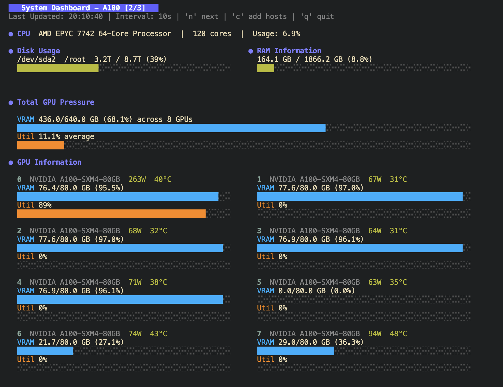

# SSH Dashboard

Monitor CPU, GPU, RAM, and disk usage on your remote servers with a live-updating terminal dashboard.

<div align="center">
  
</div>

## Installation

### Pre-built Binaries

Download the latest release for your platform from the [Releases page](https://github.com/AlpinDale/ssh-dashboard/releases).

**Quick install (Linux/macOS):**
```bash
# Download the binary for your platform
# Example for Linux AMD64:
curl -L -o ssh-dashboard https://github.com/AlpinDale/ssh-dashboard/releases/download/v0.0.1/ssh-dashboard-v0.0.1-linux-amd64

# Make it executable and move to PATH
chmod +x ssh-dashboard
sudo mv ssh-dashboard /usr/local/bin/
```

**Supported platforms:**
- `linux-amd64`, `linux-arm64`
- `darwin-amd64` (Intel Mac), `darwin-arm64` (Apple Silicon)
- `windows-amd64.exe`, `windows-arm64.exe`

### From Source

```bash
git clone https://github.com/AlpinDale/ssh-dashboard.git
cd ssh-dashboard
make install
```

This will install to `~/.local/bin`. Make sure this directory is in your PATH (it usually is):

```bash
export PATH="$HOME/.local/bin:$PATH"
```

### Prerequisites

- Go 1.21 or higher
- SSH access to remote hosts
- SSH keys loaded in your SSH agent

## Usage

Simply run:

```bash
ssh-dashboard
```

The tool will:
1. Scan your `~/.ssh/config` for available hosts
2. Present an interactive list to select from
3. Connect and display a live dashboard
4. Update stats every 5 seconds (configurable)

**Multi-host workflow:**
- Start by selecting one or more hosts (use `Space` to toggle selection)
- Press `Enter` to connect and view the dashboard
- While in the dashboard, press `c` to return to host selection to add/remove hosts
- Press `n` to cycle through connected hosts (like tmux sessions)
- Press `t` to toggle overview mode, showing all selected hosts at once with GPU pressure summaries
- Press `s` to exit the dashboard and drop into an interactive SSH shell with the current host
- All connections remain active - no need to reconnect!

### Configuration

**Update Interval:**

Control how often the dashboard refreshes in seconds (default: 5). Supports decimal values for sub-second updates:

```bash
# Update every second
ssh-dashboard -n 1

# Update 10 times per second (100ms)
ssh-dashboard -n 0.1

# or with an env var
export SSH_DASHBOARD_INTERVAL=0.5
ssh-dashboard
```

**Keybindings:**
- `q` or `Ctrl+C` - Quit
- `Space` - Select/deselect hosts (in host selection screen)
- `Enter` - Connect to selected host(s)
- `n` - Switch to next host (when multiple hosts selected)
- `t` - Toggle overview screen (shows all hosts at once)
- `s` - Exit and SSH into current host
- `c` - Add hosts (from dashboard, returns to host selection)

## SSH Configuration

Make sure your `~/.ssh/config` is properly configured:

```
Host myserver
    HostName 192.168.1.100
    User username
    Port 22  # optional
    IdentityFile ~/.ssh/id_rsa  # optional

Host gpu-server
    HostName gpu.example.com
    User admin
    IdentityFile ~/.ssh/id_ed25519  # optional
```

### SSH Agent

The dashboard uses SSH agent for authentication. Make sure your keys are loaded:

```bash
ssh-add ~/.ssh/id_rsa
ssh-add ~/.ssh/id_ed25519

# verify
ssh-add -l
```

## Remote Requirements

The remote hosts should have these commands available:
- `lscpu` - CPU information
- `top` - CPU usage
- `free` - RAM information
- `df` - Disk usage
- `nvidia-smi` - GPU information (NVIDIA GPUs only)
- `amd-smi` or `rocm-smi` - GPU information (AMD GPUs only)

Most Linux distributions include these by default.

## Development

### Build

```bash
make build
```

### Run

```bash
make run
```

### Build for Multiple Platforms

The project uses [GoReleaser](https://goreleaser.com/) for multi-platform builds and releases.

**Test the release locally:**
```bash
goreleaser release --snapshot --clean
```

**Build all platforms with Make:**
```bash
make build-all
```

This creates binaries for:
- Linux (amd64, arm64)
- macOS (amd64, arm64)
- Windows (amd64, arm64)

### Clean

```bash
make clean
```

## License

MIT License - see LICENSE file for details.

## Contributing

Contributions are welcome! Please feel free to submit a Pull Request.

## Troubleshooting

### Connection Issues
- Verify your SSH config is correct
- Test manual connection: `ssh hostname`
- Ensure SSH keys are loaded: `ssh-add -l`

### Missing GPU Information
- (NVIDIA) Verify NVIDIA drivers are installed: `ssh hostname nvidia-smi`
- (AMD) Verify AMD drivers are installed: `ssh hostname amd-smi` or `ssh hostname rocm-smi`

### Permission Denied
- Check SSH key permissions (should be 600)
- Verify the user has appropriate access rights

## Acknowledgments

Built with:
- [Bubble Tea](https://github.com/charmbracelet/bubbletea) - TUI framework
- [Lipgloss](https://github.com/charmbracelet/lipgloss) - Terminal styling
- [Bubbles](https://github.com/charmbracelet/bubbles) - TUI components
